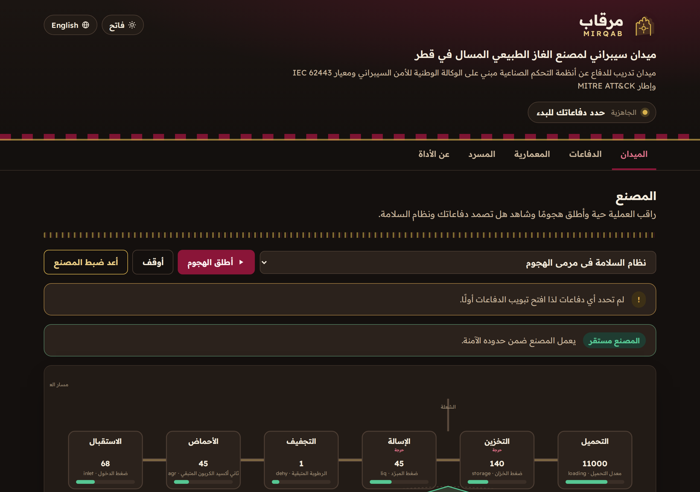
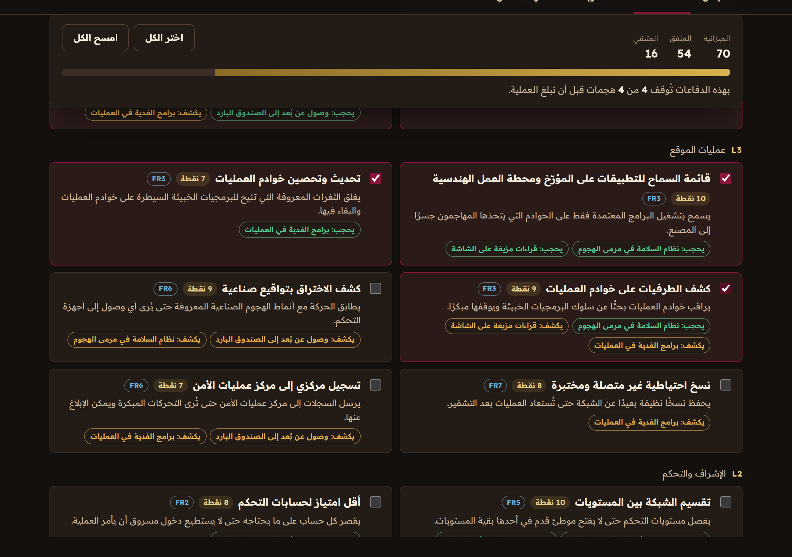
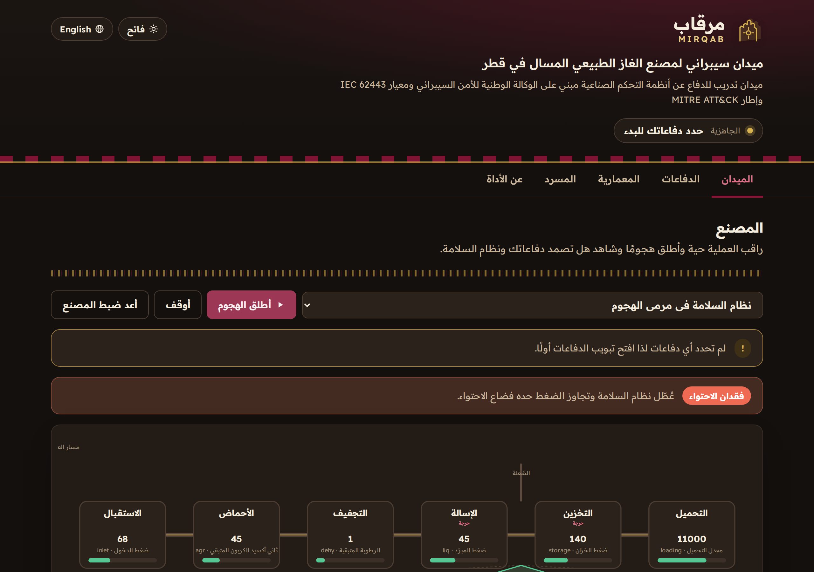

<div align="center">

# مرقاب &middot; Mirqab

**An open source LNG plant cyber range for Qatar**

ميدان سيبراني مفتوح المصدر لمصنع غاز طبيعي مسال في قطر

[**Open the live range &rarr; mirqab.3li.info**](https://mirqab.3li.info/)

</div>

---

## What this is

Mirqab is a browser based cyber range for defenders of operational technology. It shows a fictional
liquefied natural gas plant as a live process, lets you spend a limited budget on defensive controls,
then launches realistic attacks and shows you the ending your defenses earned. The safety instrumented
system is a first class character: in most scenarios it trips the plant to a safe state even when the
attacker gets in, and only a specific safety focused attack can defeat it and cause a loss of
containment.

Everything is bilingual in Arabic and English, works offline as static files and ships with a Model
Context Protocol server so an AI assistant can teach from the same model.

مرقاب ميدان سيبراني في المتصفح للمدافعين عن أنظمة التشغيل الصناعية يعرض مصنعاً افتراضياً للغاز الطبيعي
المسال كعملية حية ثم يتيح لك إنفاق ميزانية محدودة على ضوابط دفاعية ثم يطلق هجمات واقعية ويظهر لك النهاية
التي حققتها دفاعاتك. نظام الأمان المجهز هو بطل القصة لأنه في معظم السيناريوهات يوقف المصنع إلى حالة آمنة
حتى لو دخل المهاجم ولا يستطيع كسره إلا هجوم واحد يستهدف الأمان نفسه فيؤدي إلى فقد الاحتواء.

## The name

A **mirqab** is the lookout instrument the watchman raised to his eye on the towers of Qatar's old
forts to scan the desert and the sea for what was coming. The plant is your coast to watch. From the
mirqab you see the threat approach across the kill chain, and you decide what to defend.

المرقاب هو أداة الرصد التي كان الحارس يرفعها إلى عينه فوق أبراج القلاع القطرية القديمة ليمسح الصحراء
والبحر بحثاً عما هو قادم. المصنع هو ساحلك الذي تراقبه فمن المرقاب ترى التهديد يقترب عبر سلسلة الهجوم ثم
تقرر ما الذي تدافع عنه.

## Features

- A live plant schematic with six process units, real variable bands and a safety system that arms, trips or is defeated in front of you
- A defense budget that is smaller than the full catalog, so every choice is a tradeoff
- Four scenarios whose steps map to MITRE ATT&CK for ICS techniques, including a TRITON style attack on the safety system
- Outcomes that follow engineering logic: contained, safe trip, disruption or a loss of containment
- An incident playbook for each scenario aligned to the NCSA phases and the two hour critical report
- A Purdue model view with the seven IEC 62443 foundational requirements
- A bilingual OT and ICS glossary
- A dark heritage theme by default and a light theme, full keyboard access and a strict Content Security Policy
- A zero dependency MCP server that exposes the whole model as read only tools

## Screenshots

<div align="center">







</div>

## The MCP server

Mirqab ships an MCP server so any assistant that speaks the Model Context Protocol can read the plant,
the controls, the attack paths and the playbooks, and can run the same planner the site uses. It has no
dependencies and it is read only.

Run it directly from the repository:

```
npx -y github:SiteQ8/Mirqab
```

Point your MCP client at that command:

```json
{
  "mcpServers": {
    "mirqab": {
      "command": "npx",
      "args": ["-y", "github:SiteQ8/Mirqab"]
    }
  }
}
```

### Tools

| Tool | What it returns |
| --- | --- |
| `overview` | What the range is, its counts and the training disclaimer |
| `list_units` | The six process units, their variable bands and the safety system |
| `list_zones` | The Purdue levels and the seven IEC 62443 foundational requirements |
| `list_controls` | The defensive controls with level, requirement, cost and what they block or detect |
| `list_scenarios` | The scenarios with a short summary of each kill chain |
| `get_scenario` | One scenario in full with every step, its MITRE technique, the lesson and the playbook |
| `plan_defense` | Run a scenario against chosen controls and get each step state and the outcome |
| `assess_posture` | Budget spent, coverage and how many attacks a set of controls stops |
| `glossary` | The OT and ICS glossary, with an optional query in Arabic or English |
| `sources` | The authoritative sources behind the range |

## Run locally

Requirements: Node 18 or newer.

```
git clone https://github.com/SiteQ8/Mirqab.git
cd Mirqab
npm run build       # assemble docs/data/bundle.json from data/src
npm test            # run the full test suite
npm run preflight   # build, test and check the site is release ready
```

Serve the site with any static server from the `docs` folder, for example:

```
python3 -m http.server 8000 --directory docs
```

## How it is built

- `data/src` holds the plant, zones, controls, scenarios, incident phases, glossary and every bilingual string
- `scripts/build.mjs` assembles those into `docs/data/bundle.json` and cross checks every reference
- `docs/assets/core.js` is the pure engine, shared by the site and the MCP server
- `docs/assets/app.js` renders the site and drives the live simulation
- `mcp/server.mjs` is the MCP server
- `test` enforces the data model, the engine outcomes, the Arabic writing rules, the Content Security Policy and the MCP contract

## Sources

- National Cyber Security Agency of Qatar, National Information Assurance and incident material
- NIST SP 800-82 Guide to Operational Technology Security
- NIST SP 800-61 Computer Security Incident Handling Guide
- ISA and IEC 62443 series for industrial automation and control systems security
- MITRE ATT&CK for ICS

## Disclaimer

The plant is fictional and composite. It is not any real facility and it carries no operational detail
from any real plant. Mirqab is for learning defensive engineering only. See NOTICE.md.

## License

MIT. Copyright (c) 2026 Ali AlEnezi. See LICENSE.
